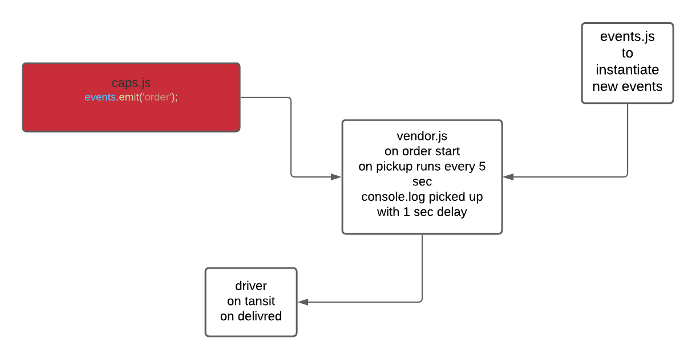

# caps

## Author: 
Waleed Farraj

## Version: 
1.0.0 

## Overview

CAPS will simulate a delivery service where vendors (such a flower shops) will ship products using our delivery service and when our drivers deliver them, be notified that their customers received what they purchased.

## Getting Started

These instructions will get you a copy of the project up and running on your local machine for development and testing purposes.

## Prerequisites

- Operating system: Mac OS, Windows, Linux
- Git
  Follow the instruction in the links below to install git in your machine

## Installation

1. open your terminal

2. Clone the repo

3. npm init -y 

4. npm i 

4. then npm run dev 

## packages needed

- faker

# UML 

